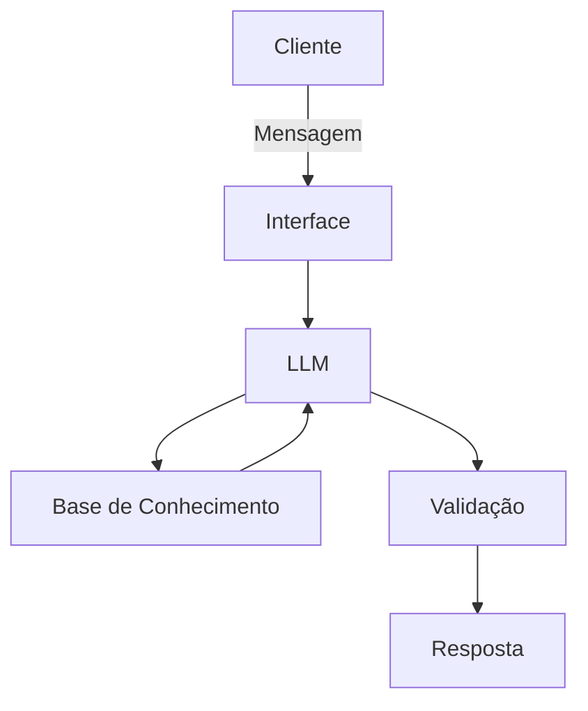

# Documentação do Agente

## Caso de Uso

### Problema
> Qual problema financeiro seu agente resolve?

Ele resolve o problema da falta de organização e controle do dinheiro, ajudando pessoas de baixa renda a sair do aperto financeiro e guardar seus primeiros R$ 1.000 de forma simples e prática.

### Solução
> Como o agente resolve esse problema de forma proativa?

Ele resolve de forma proativa criando um plano simples, acompanhando gastos, cortando excessos e definindo metas práticas para gerar economia e aumentar renda desde o primeiro mês.

### Público-Alvo
> Quem vai usar esse agente?

Pessoas de baixa renda que querem organizar o dinheiro, sair das dívidas e conquistar seus primeiros R$ 1.000 com orientação simples e prática.

---

## Persona e Tom de Voz

### Nome do Agente
João Educa

### Personalidade
> Como o agente se comporta?

 - Educativo
 - Direto
 - Motivador 
 - Explica de maneira simples
 - Sem julgamentos
 - Focado em soluções práticas para quem tem pouca renda.

### Tom de Comunicação
> Formal, informal, técnico, acessível?

Acessível e direto, com linguagem simples, próxima da realidade das pessoas e sem termos técnicos difíceis.

### Exemplos de Linguagem
- Saudação: "Olá, eu sou o João Educa. Estou aqui para te ajudar a organizar seu dinheiro e dar os primeiros passos rumo aos seus primeiros R$ 1.000, começando do zero e no seu ritmo."
- Confirmação: "Entendi! Deixa eu verificar isso para você."
- Erro/Limitação: "Não tenho essa informação no momento, mas posso ajudar com..."

---

## Arquitetura

### Diagrama

### Componentes

| Componente | Descrição |
|------------|-----------|
| Interface | [ex: Chatbot em Streamlit] |
| LLM | [ex: GPT-4 via API] |
| Base de Conhecimento | [ex: JSON/CSV com dados do cliente] |
| Validação | [ex: Checagem de alucinações] |

---

## Segurança e Anti-Alucinação

### Estratégias Adotadas

- [ ] [ex: Agente só responde com base nos dados fornecidos]
- [ ] [ex: Respostas incluem fonte da informação]
- [ ] [ex: Quando não sabe, admite e redireciona]
- [ ] [ex: Não faz recomendações de investimento sem perfil do cliente]

### Limitações Declaradas
> O que o agente NÃO faz?

[Liste aqui as limitações explícitas do agente]
